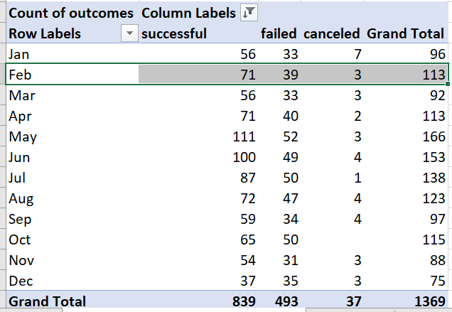
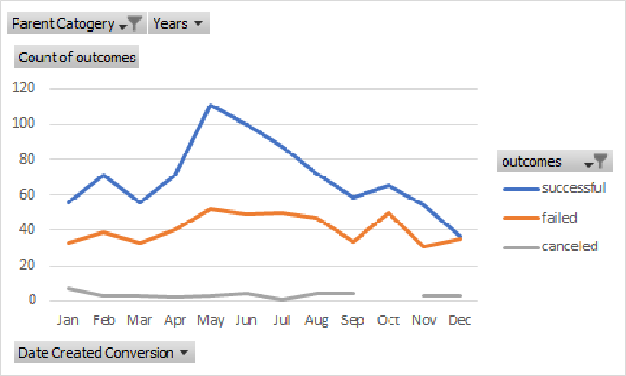
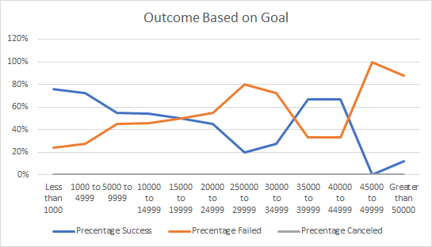
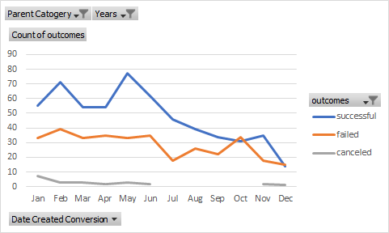

# Challenge1
# Kickstarting with Excel

## Overview of Project
Louise's play "Fever" came close to it's fundraising goal in a short amount of time.The objective of the project is to analyze the given dataset to show Louise how different campaign fared in relation their launch dates and their funding goals.

Using Kickstarter dataset,the project will visualize campaign outcomes based on their launch dates and their funding goals.

### Purpose
Using the Kickstarter data set visualize campaign outcomes based on it's launch dates and funding goals.

## Analyze and Challenges

### Analysis of Outcomes Based on Launch Date
- In the Kickstarter_Challenge.xlsx workbook , I created a new column labeled "Years".In the "Years" column, use the YEAR() function to extract the year from the "Date Created Conversion" column.
- Create a pivot table from the Kickstarter worksheet,and place the pivot table in a new sheet. 
- Labaled the sheet "Theater Outcomes by Launch Date"
- Filter the pivot table based on "Parent Catogery","theotor" and "Years".
- Sort the "otcomes" field in decending order.
- used group by option to get the month value from launch date field
- Use values to count outcome, "successful","failed" and "canceled".
- then filter the column labels to show only "successful","failed" and "canceled"

- Finally created a line chart from the pivot table to visualize the relationship between outcomes and launch month.

### Analysis of Outcomes Based on Goals
- In the Kickstarter workbook,I created a new sheet and lebel it "Outcomes Based on Goald."
In the new sheet,create the following columns to hold the data:
  - Goal
  - Number Successful
  - Number Failed
  - Number Canceled
  - Total Projects
  - Precentage Successful
  - Precentage Failed
  - Precentage Canceled
 
- In the "Goal" column,created amount ranges as per below
  - Less than 1000
  - 1000 to 4999
  - 5000 to 9999
  - 10000 to 14999
  - 15000 to 19999
  - 20000 to 24999
  - 25000 to 29999
  - 30000 to 34999
  - 35000 to 39999
  - 40000 to 44999
  - Greater than 50000
- I used COUNTIFS() function to calaculate the "Number Successful","Number Failed" and "Number Canceled",on the "goal amount" column for the created ranges,and on the Subcatogery" column using "plays" as criteria.
 
    i.e: =COUNTIFS(kickstater!$D:$D,"<1000",kickstarter!$F:$F,"successfu[l",;kickstarter!$R:$R,"plays")

- Used SUM() function to populate the "Total Projects" column with the number of successful,failed and canled projects for each row 
- calculated the precentage of successful,failed and canceled projects for each row
- Finally Create a line chart titled "Outcome Based on Goal" to visualize the relationship between goal- amount ranges on the x-axis and the precentage of successful,failed or canceled projects on the y-axis.

### Challenge and Difficulties Encountered

 #### Diliverable 1
  Chalenge is how to pull month from launch date,I reffered bellow URL to group by launch date field by month.

  [link to group by launch date](https://trumpexcel.com/group-dates-in-pivot-tables-excel/).

#### Diliverable 2
  When doing Outcome vs Goal challenge,some counts came wrong because I used ">1000 and < 4999" in count if function,so I corrected it as >=1000 and <=4999.Got right counts after the correction.
 
 
 ## Results
 
  ### Conclutions about the Outcomes based on Launch Date
  This Pivot table created based on Parent catogery "Theoter",it shows in the graph highest successful rate in months MAy to July and lowest successful rate end - begining (Jan,Dec) of year piriord.
  
  #### Conclutions
  - There is higher posibility to success the play in May-July time piriord.
  - Towards the end of the year posibility to success the play keep reducing.

### Conclution about Outcome based on Goals
  -If the Goal amount in range of less than 1000 and between 1000 to 4999 to successful precentage is 76% and 73% and canceled precentage is 24% and 27%.
  
  #### Conclution
   We can conclude that if goal amount is low precentage of success is higher according to the this dataset.
   
   
## Limitations of this dataset
 
  In this crowed funding dataset only around 25% of data is for parent catogery "theoter".If there are more data on thetor catogery in this dataset we could have give more accurate analysis.
  
  ## Other possible tables and/or graphs that we could create
  
  I created another pivot table using diliverable 1 pivot chart and I filtered recent 3 years 2015,2016&2017.
  
  This table has most recent data and it shows how out come changed according to month for recent 3 years.
  
  
  
  
